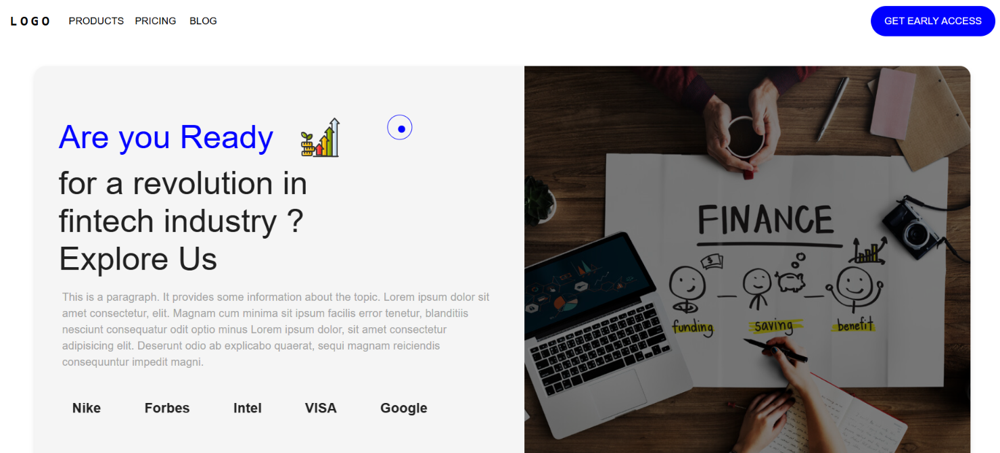

# Fintech Landing UI

A single-page marketing/landing UI for a fictional "fintech" product, built with Vite + React 18.

## Purpose

This project was created to practice **mouse actions with different styles** — custom
animated cursors, cursor state changes on section hover, and scroll/pointer-driven
animation. There is no backend; it's a static frontend used as a playground for
interaction and animation techniques.

## What's inside

- Custom dual-cursor effect that follows the pointer and changes style on section hover ([src/App.jsx](src/App.jsx)).
- Animated sections: Spline 3D, Lottie, Framer Motion, marquee, scroll-triggered effects.
- MUI primitives and `react-router-dom`.

## Structure

- `src/main.jsx` -> `src/App.jsx` — entry and custom cursor logic.
- `src/pages/` — `home/Home.jsx`, `navigation/Navigation.jsx` top-level composition.
- `src/components/` — section building blocks: `HomeImage`, `HomePage`,
  `HighLightTypoGraphy`, `ImageSvg`, `Model`, `SecondContent`, `ThirdSection`, `Footer`.
- `src/assets/` — images plus Lottie JSON (`animationData.json`, `cards.json`,
  `graph.json`, `money.json`, `wallet.json`).

## Commands

| Command | Description |
| --- | --- |
| `npm install` | Install dependencies |
| `npm run dev` | Start dev server at http://localhost:5173 |

No test suite is defined.
